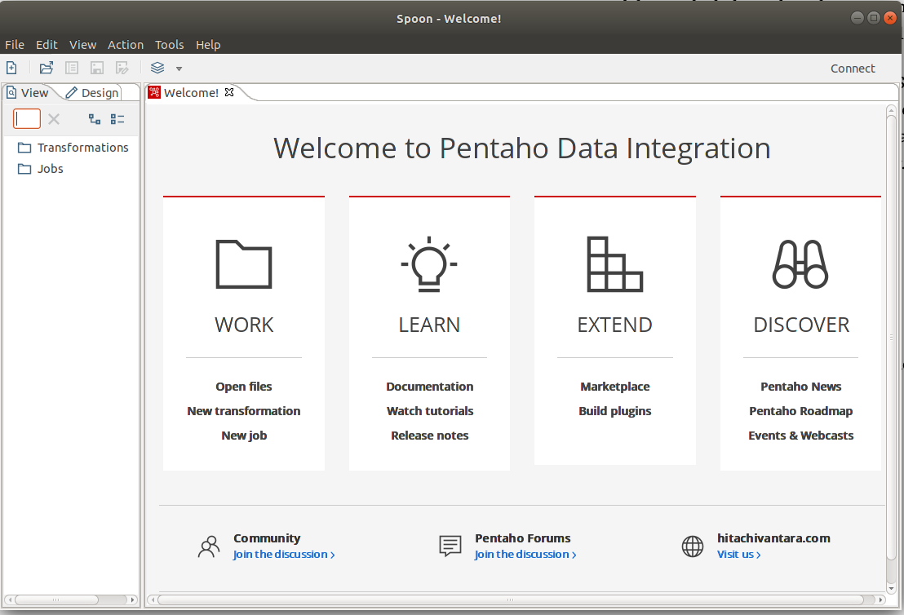

*Processo de Extração, Transformação e Carga (ETL)de Dados*
===========================================================

Introdução
----------

Nesse capítulo serão abordados conceitos sobre o Processo de Extração,
Transformação e Carga de Dados conhecido como ETL. Para realizá-lo,
iremos utilizar a ferramenta *Pentaho Data Integration* da *suíte
Pentaho* e o Sistema Gerenciador de Banco de Dados (SGBD) *Postgres*.

Quando o projeto do *Data Warehouse* (DW) é projetado, devem ser
projetados processos para preencher os dados dentro do *Data Warehouse*.
O termo **integração de dados** é utilizado para descrever o conjunto de
atividades que contribuem para o processo de preenchimento dos DWs.

O *Pentaho* oferece uma coleção de ferramentas conhecidas *Pentaho Data
Integration* (PDI) que são projetados para suportar essa tarefa.

Atividades de Integração de Dados 
----------------------------------

Uma forma de compreender a **integração de dados** é decompor o processo
de preenchimento de dados de um DW em uma série de atividades distintas.
Em um nível muito alto, o problema do preenchimento de um DW consiste em
apenas três grandes tipos de atividades:

-   **Extração de** dados de um ou mais sistemas de origem. Para
    exemplo, a obtenção e carga de todos os registros de clientes que
    foram adicionados ou alterados desde o último carregamento de dados.

-   **Transformação** dos conteúdos dos dados para adequá-los a
    estrutura do DW de destino. Por exemplo, a padronização dos nomes
    dos clientes.

-   **Carregamento** dos dados no DW de destino.

Essas três atividades -- Extração, Transformação e Carga -- são
frequentemente referidas pela sigla ETL.

*Pentaho Data Integration* Conceitos e Componentes 
---------------------------------------------------

A solução ETL da suíte Pentaho é feita por meio do *Pentaho Data
Integration* (PDI) e passa por dois tipos diferentes de **objetos**:

-   **Transformações**: são atividades que realizam o processo de ETL
    propriamente dito.

-   **Jobs** : é a possibilidade de de se criar eventos que disparam de
    tempos em tempos com objetivos de executar as Transformações de
    acordo com os períodos definidos.

Para manipular os objetos, o PDI possui duas **ferramentas**:

-   ***Spoon***: é uma IDE de integração gráfica de dados para criar
    transformações e *jobs*.

-   ***Kitchen***: é uma ferramenta de linha de comando para a execução
    de *jobs*.

As ferramentas apresentadas foram desenvolvidas na linguagem Java e é
necessária sua instalação no computador local.

Instalando o PDI
----------------

Para instalar o devemos fazer o download de um arquivo zip que contém
todas as ferramentas do PDI. Para isso, segui os passos seguintes:

1.  Vá até o o endereço eletrônico:

    1.  *https://hitachiedge1.jfrog.io/ui/native/pntpub-maven-release-cache/org/pentaho/di/pdi-ce*

2.  Uma vez no sítio, faça *o download* da versão indicada pelo
    professor*.*

Isso vai iniciar o *download* do PDI.

 

**Após o download,**

1.  Descompacte o arquivo zip em um diretório desejado;

    1.  Será criado um novo diretório chamado de *data-integration*.

2.  Entre dentro do diretório criado.

3.  Execute o arquivo:

    1.  **Linux**: ./spoon.sh

    2.  **Windows**: Spoon.bat

4.  Atenção: como o programa é em linguagem *Java*, sua execução inicial
    pode demorar um tempo considerável.

5.  Após o software ter sido executado, você verá a seguinte tela:\
    

Transformando um arquivo CSV
----------------------------

Em nossa primeira transformação, vamos transformar um arquivo CSV em
XLS. Durante o processo, iremos acrescentar um campo sequencial e este
campo será salvo na primeira posição do arquivo XLS.

 

Iremos usar o arquivo *02\_PedidoClienteProduto.csv* disponível no AVA.
Salve este arquivo em um diretório que será usado durante os exercícios.

 

Para realizar a transformação, faça:

1.  Com o PDI aberto, clique com o botão direito do mouse sobre a opção
    *View -\> Transformations* (ao lado superior esquerdo) e escolha
    *new*.

2.  Em seguida, escolha o **componente** ***Input -\> CSV file input***
    *(*lado superior esquerdo*)*.

3.  Arraste o componente para a Lona (toda a área do lado direito).

4.  Edite o componente com um duplo clique sobre ele e escolha o arquivo
    a ser importado clicando no botão *browser*.

5.  Em seguida, clique no botão *Get Fields* localizado na parte
    inferior da janela.

6.  Feito isso, clique no botão *Preview* para ver os dados do arquivo.  

7.  Para finalizar, clique no botão *Ok*.

8.  Em seguida, escolha o **componente** ***Transform -\> Add
    sequence*** com um duplo clique.

    1.  Note que ele vai para a lona e um fluxo partindo do componente
        ***CSV file input*** é criado de forma automática. Porém, isso
        nem sempre acontece.

9.  Edite o componente e altere o campo *Name of value* para
    *id\_pedido*.

10. Salve o arquivo de transformação com o nome
    *01\_transformacao*.*ktr* na pasta que esta o arquivo csv baixado do
    AVA.

    1.  Note que o nome do arquivo de transformação é terminado com
        ***ktr***.

11. Clique no botão *Preview* (formato de um olho), na barra de
    ferramentas localizada na parte Superior.    

12. Agora vamos adicionar o **componente** ***Output*** ***-\>***
    ***Microsoft excel output***.

13. Edite o componente e indique o local em que será salvo o arquivo
    clicando no botão *Browse*.

    1.  Atribua o nome do arquivo de *01\_primeiro\_saida.xls*.

14. Ainda no mesmo componente, clique na aba *Fields* e clique no botão
    *Get Fields* para receber todos os campos que serão salvos no
    arquivo *xls*.

15. Note que o campo *id*\_*pedido* está por último. Com o botão direito
    sobre ele, mova até a primeira posição.

16. Salve a transformação e a execute clicando no botão *Run* na barra
    de ferramentas.

17. Verifique no local de saída o arquivo exportado.

Chaves Delegadas (*Surrogate Keys*)
-----------------------------------

As chaves primárias em sistemas transacionais como os *Enterprise
Resourse Planning* (ERP) são denominadas de *chaves* *naturais* e quando
os dados são carregados para um Data Warehouse (DW) podem causar certos
problemas relacionados a incompatibilidade e repetição.

Manter uma chave delegada para as dimensões em vez de utilizar as chaves
naturais operacionais é vantajoso porque isso livra o ambiente DW de
alterações operacionais. Manter uma chave sem significado possibilita ao
DW ser independente de alterações nos sistemas transacionais para manter
a compatibilidade dos dados.

Um dos termos mais usados para as novas chaves do DW é o de *Chave
Delegada* ou ***Surrogate*** ***Key*** (**SK**).

Adotar SKs obriga o processo de ETL a mapear as chaves naturais em
chaves delegadas e a substituir uma pela outra nos momentos certos.

Chaves delegadas têm papel importante na implementação de dimensões de
variação lenta (SCD).

Dimensões de Variação Lenta
---------------------------

Em um sistema de transacional, é comum que o estado dos dados mudem ao
longo do tempo. Por exemplo, uma pessoa foi cadastrada com estado civil
*solteiro* e no decorrer do tempo passou para *casado*. Ou, a pessoa
residia na cidade de *São* *Paulo* e se mudou para *Campinas*.

Para mapear essas mudanças, é utilizado um recurso denominado de
*Dimensões de Variações Lenta* ou ***Slowly Changing Dimension***
(**SCD).**

Existem 3 tipos de SCDs:

-   **SCD 1**: é a alteração que não armazena histórico na dimensão, ou
    seja, não é feito o versionamento do registro modificado. Trata-se
    do tipo mais simples, pois não há nenhum controle específico para a
    atualização dos dados, havendo apenas a sobreposição.

-   **SCD 2**: nesse tipo de SCD é adicionado um novo registro com as
    mudanças, preservando sempre os dados anteriores. Dessa forma, os
    registros da tabela fato vão apontar para a versão correspondente
    nas dimensões de acordo com a data de referência.

-   **SCD 3**: permite manter as modificações no mesmo registro. Essa
    técnica funciona com a adição de uma nova coluna na tabela de
    dimensão, onde é armazenada a atualização, mantendo na antiga coluna
    o valor anterior.

Realizando ETL na Base de Dados
-------------------------------

Vamos agora utilizar o PDI para fazer o processo de ETL sobre os dados
do ERP que está no *postgre* para um DW que também esteja armazenado no
*postgre*.

Os dados migrarão da banco de dados ERP (*ovtd\_erp*) para o DW
(*ovtd\_dw*) no formato Dimensional de Estrela.

Após a realização do ETL, teremos:

-   **Tabela Fato**: *bi\_fpedido*.

-   **Tabelas Dimensões**: *bi\_dcliente, bi\_dvendedor, bi\_dproduto* e
    *bi\_dtempo*.

Porém, antes de realizarmos o ETL, vamos realizar a conexão entre o PDI
e o *postgre*.

### Conectando PDI ao PostgreSQL

Para fazer com o PDI acesse os dados das tabelas dentro do Postgre,
devemos realizar os seguintes passos:

1.  Feche todas as abas de transformações.

2.  Clique na aba *View* (canto superior esquerdo) e em seguida, duplo
    clique em *Transformations*.

3.  Agora, clique no menu *File -\> New -\> Database Connection*.

4.  Para o **banco de dados** ***ovtd1\_erp***, preencha os campos para
    conexão: *Host Name, Database Name, Port Number, Username e
    Passoword*.

5.  Faça o teste de conexão clicando no botão *Test* na parte inferior.

6.  Atribua o nome de ***ovtd1\_erp*** no campo *Connection Name* na
    parte superior da janela.      

7.  Para o **banco de dados ovtd1\_dw**, preencha os campos para
    conexão: *Host Name, Database Name, Port Number, Username e
    Passoword*.

8.  Faça o teste de conexão clicando no botão *Test* na parte inferior.

9.  Atribua o nome de ***ovtd1\_dw*** no campo *Connection Name* na
    parte superior da janela.

### Compartilhando Conexões

Criadas as conexões, para poderem ser utilizadas por todas as
transformações e *jobs*, temos que compartilhá-la e para isso faça:

1.  Com a transformação aberta, vá a aba *View -\> Transformations -\>
    Transformation 1 -\> Database connections*.

2.  Clique com o botão esquerdo sobre ovtd\_dw e escolha a opção
    *Share*.

3.  Clique com o botão esquerdo sobre ovtd\_erp e escolha a opção
    *Share*.

### ETL da Dimensão Cliente

Configurado as conexões com o banco de dados, podemos, agora, realizar o
processo de ETL sobre a dimensão Cliente.

Iremos transferir os dados da tabela cliente do ERP para a dimensão
clientes (*bi*\_*dcliente*) no DW.

Vamos, também, definir quais campos da tabela cliente serão marcados com
SCD 2.

O ETL é feito da seguinte maneira:

1.  Selecione o **componente** ***Design -\> Input -\> Table input*** e
    arraste para a lona.

2.  Edite o componente *Table input*.

3.  Preencha as seguintes informações:

    1.  **Step name**: Carregar dados de Clientes

    2.  **Connection**: *ovtd\_erp*

    3.  **SQL**:\
        *SELECT codigo\_cliente , nome\_cliente , endereco , cidade ,
        cep , uf FROM cliente*

4.  Clique no botão *Preview*.
    
   
5.  Selecione o **componente** ***Design -\> Data Warehouse -\>
    Dimension lookup/update***

6.  Preencha:

    1.  **Step name**: Salvar dados de Clientes

    2.  **Connnection**: *ovtd\_dw*

    3.  **Target** **table**: *bi\_dcliente*

    4.  Aba ***keys***:

        1.  **Dimension field**: *codigo\_cliente*

        2.  **Field in stream**: *codigo\_cliente*

    5.  Aba ***Fields***: clique no botão Get Fields e preencha:

        1.  **Dimension field:** nome\_cliente; **Stream field to
            compare with**: nome\_cliente; **type of dimension update**
            (SCD): Punch through (sem SCD)

        2.  **Dimension field:** endereco; **Stream field to compare
            with**: endereco; **type of dimension update** (SCD): insert
            (SCD 2)

        3.  **Dimension field:** cidade; **Stream field to compare
            with**: cidade; **type of dimension update** (SCD): insert
            (SCD 2)

        4.  **Dimension field:** cep; **Stream field to compare with**:
            cep; **type of dimension update** (SCD): insert (SCD 2)

        5.  **Dimension field:** uf; **Stream field to compare with**:
            uf; **type of dimension update** (SCD): insert (SCD 2)

    6.  Campo ***Technical key field***: *dcliente\_sk* (define a
        *Surrogate Key*)

    7.  ***Creation technical key***: escolha *Use auto increment
        field*.

    8.  Clique no botão SQL (na parte inferior da tela) e execute a
        consulta para criar a tabela *bi*\_*dCliente*.

7.  **Salve** a transformação e a execute.

### ETL da Dimensão Vendedor

Para a dimensão vendedor (bi\_dvendedor), iremos fazer os mesmos
procedimentos que a dimensão cliente.

Os passos são:

1.  Crie uma nova transformação: View -\> duplo clique em
    Transformations.

2.  Selecione o **componente** ***Design -\> Input -\> Table input*** e
    arraste para a lona.

3.  Edite o componente *Table input*.

4.  Preencha as seguintes informações:

    1.  **Step name**: Carregar dados de Vendedores

    2.  **Connection**: *ovtd\_erp*

    3.  **SQL**:\
        *SELECT codigo\_vendedor , nome\_vendedor , salario\_fixo ,
        faixa\_comissao FROM vendedor*

5.  Clique no botão *Preview*.
    

6.  Selecione o **componente** ***Design -\> Data Warehouse -\>
    Dimension lookup/update***

7.  Preencha:

    1.  **Step name**: Salvar dados de Vendedores

    2.  **Connnection**: *ovtd\_dw*

    3.  **Target** **table**: *bi\_dvendedor*

    4.  Aba ***keys***:

        1.  **Dimension field**: *codigo\_vendedor*

        2.  **Field in stream**: *codigo\_vendedor*

    5.  Aba ***Fields***: clique no botão Get Fields e preencha:

        1.  **Dimension field:** nome\_vendedor; **Stream field to
            compare with**: nome\_vendedor; **type of dimension update**
            (SCD): Punch through (sem SCD)

        2.  **Dimension field:** salario\_fixo; **Stream field to
            compare with**: salario\_fixo; **type of dimension update**
            (SCD): insert (SCD 2)

        3.  **Dimension field:** faixa\_comissao; **Stream field to
            compare with**: faixa\_comissao; **type of dimension
            update** (SCD): insert (SCD 2)

    6.  Campo ***Technical key field***: *dvendedor\_sk* (define a
        *Surrogate Key*)

    7.  ***Creation technical key***: escolha *Use auto increment
        field*.

    8.  Clique no botão SQL (na parte inferior da tela) e execute a
        consulta para criar a tabela *bi*\_*d*Vendedor.

8.  **Salve** a transformação e a execute.

9.  No próximo Slide vamos testar uma modificação nos dados de
    vendedores.

#### Testando alteração em dados de Vendedores

Vamos testar alterar a Faixa\_Comissao do vendedor João de código 101 de
C para B e ver o que acontece quando carregamos os dados novamente para
o DW.

Para isso faça:

1.  Clique no **botão** *Explore on of the avaliable* \... na barra de
    ferramentas.

2.  Selecione *ovtd\_erp*.

3.  Abra a árvore *ovtd\_erp -\> Tables -\> Vendedor*.

4.  Clique com o botão direito sobre *Vendedor -\> View SQL*.

5.  Digite a consulta:\
    *select \* from vendedor where codigo\_vendedor = 101;*

6.  Execute a consulta.

7.  Feche a janela com os dados do Vendedor.

8.  Digite agora a consulta para alterar a Faixa\_Salaria de C para B:\
    *update vendedor set faixa\_comissao = 'B' where codigo\_vendedor =
    101;*

9.  Execute o Update.

10. Agora, novamente execute a consulta:\
    *select \* from vendedor where codigo\_vendedor = 101;*

11. Feche as janelas de Banco de Dados.

12. Execute novamente a Transformação.

13. Novamente, clique no **botão** *Explore on of the avaliable* \... na
    barra de ferramentas.

14. Selecione *ovtd\_*dw.

15. Abra a árvore *ovtd\_dw -\> Tables -\> bi\_dVendedor*.

16. Clique com o botão direito sobre *bi\_dVendedor -\> View SQL*.

17. Digite a consulta:\
    *select \* from vendedor where codigo\_vendedor =* ***101****;*

18. Execute a consulta e verifique a versão dos registros.

### ETL da Dimensão Produto

Para a dimensão produto (bi\_dproduto), iremos fazer os mesmos
procedimentos que as dimensões anteriores.

Os passos são:

1.  Crie uma nova transformação: View -\> duplo clique em
    Transformations.

2.  Selecione o **componente** ***Design -\> Input -\> Table input*** e
    arraste para a lona.

3.  Edite o componente *Table input*.

4.  Preencha as seguintes informações:

    1.  **Step name**: Carregar dados de Produtos

    2.  **Connection**: *ovtd\_erp*

    3.  **SQL**:\
        *SELECT codigo\_produto , unidade , descricao , valor\_venda ,
        valor\_custo , qtde\_minima , quantidade , comissao\_produto
        FROM .produto*

5.  Clique no botão *Preview*.
    

6.  Selecione o **componente** ***Design -\> Data Warehouse -\>
    Dimension lookup/update***

7.  Preencha:

    1.  **Step name**: Salvar dados de Produto

    2.  **Connnection**: *ovtd\_dw*

    3.  **Target** **table**: *bi\_dproduto*

    4.  Aba ***keys***:

        1.  **Dimension field**: *codigo\_produto*

        2.  **Field in stream**: *codigo\_produto*

    5.  Aba ***Fields***: clique no botão Get Fields e preencha:

        1.  Deixe todos os campos como **type of dimension update**
            (SCD): Punch through (sem SCD). Nós não iremos fazer SCD2.

    6.  Campo ***Technical key field***: *dproduto\_sk* (define a
        *Surrogate Key*)

    7.  ***Creation technical key***: escolha *Use auto increment
        field*.

    8.  Clique no botão SQL (na parte inferior da tela) e execute a
        consulta para criar a tabela *bi*\_*d*Produto.

8.  **Salve** a transformação e a execute.

### ETL da Dimensão Tempo

Para a dimensão produto (bi\_dtempo), iremos fazer procedimentos
**diferentes** das dimensões anteriores.

Os passos são:

1.  Crie uma nova transformação: View -\> duplo clique em
    Transformations.

2.  Selecione o **componente** ***Design -\> Input -\> Generate rows***
    e arraste para a lona.

3.  Edite o componente *Generate rows*.

4.  Preencha as seguintes informações:

    1.  **Step name**: Gerar datas

    2.  **Connection**: *ovtd\_erp*

    3.  **Limit***: 1*

5.  Clique no botão *Preview*.\
    -----

6.  Selecione o **componente** ***Design -\> Scripting -\> Execute SQL
    script***

7.  Preencha:

    1.  **Step name**: Criar dimensão tempo

    2.  **Connnection**: *ovtd\_dw*

    3.  **Sql Script to execute** \...: executar a parte *Passo DW1 -
        Cria dimensao tempo* do arquivo de *script*. **Atenção**,
        verifique a data de início da dimensão tempo.

    4.  Clique no botão SQL (na parte inferior da tela) e execute a
        consulta para criar a tabela *bi*\_*dtempo*.

8.  **Salve** a transformação e a execute.

### ETL do Fato Pedido

Para a dimensão produto (*bi*\_*fpedido*), iremos fazer os procedimentos
**diferentes** das dimensões anteriores.

A tabela *bi*\_*fpedido* terá uma estrutura assim:

-   fpedido\_sk, num\_pedido, codigo\_cliente, codigo\_vendedor,
    data\_pedido, codigo\_produto, quantidade, valor\_venda ,
    valor\_custo

Os passos são:

1.  Crie uma nova transformação: View -\> duplo clique em
    Transformations.

2.  Selecione o **componente** ***Design -\> Input -\> Table input*** e
    arraste para a lona.

3.  Edite o componente *Table input*.

4.  Preencha as seguintes informações:

    1.  **Step name**: Carregar dados de ItemPedido

    2.  **Connection**: *ovtd\_erp*

    3.  **SQL**:\
        *SELECT num\_pedido , codigo\_produto , quantidade ,
        valor\_venda , valor\_custo FROM item\_pedido*

5.  Clique no botão *Preview*.\
    -----

6.  Selecione o **componente** ***Design -\> Database-\> Database
    Lookup***

7.  Preencha:

    1.  **Step name**: Encontrar dados do pedido

    2.  **Connnection**: *ovtd\_erp*

    3.  **Lookup** **table**: pedido

    4.  ***The key(*s**) **to look up the value(s)**:

        1.  **Table field**: *num\_pedido*

        2.  **Field1**: *num\_pedido*

    5.  **Values to return from the lookup table:**

        1.  **Field**: *prazo*\_*entrega*; **Type**: *Integer*

        2.  **Field**: *codigo*\_*cliente*; **Type**: *BigNumber*

        3.  **Field**: *codigo*\_*vendedor*; **Type**: *BigNumber*

        4.  **Field**: *data*\_*pedido*; **Type**: *Date*

    6.  **Do not pass the row if** \...: *checado*.

8.  Selecione o **componente** ***Design -\> Database-\> Database
    Lookup***

9.  Preencha:

    1.  **Step name**: Encontrar SK de dClientes

    2.  **Connnection**: *ovtd\_dw*

    3.  **Lookup** **table**: *bi\_dcliente*

    4.  ***The key(*s**) **to look up the value(s)**:

        1.  **Table field**: *codigo\_cliente*

        2.  **Field1**: *codigo\_cliente*

    5.  **Values to return from the lookup table:**

        1.  **Field**: *dcliente\_sk*; **Type**: *BigNumber*

    6.  **Do not pass the row if** \...: *checado*.

10. Selecione o **componente** ***Design -\> Database-\> Database
    Lookup***

11. Preencha:

    1.  **Step name**: Encontrar SK de dVendedor

    2.  **Connnection**: *ovtd\_dw*

    3.  **Lookup** **table**: *bi\_dvendedor*

    4.  ***The key(*s**) **to look up the value(s)**:

        1.  **Table field**: *codigo\_vendedor*

        2.  **Field1**: *codigo\_vendedor*

    5.  **Values to return from the lookup table:**

        1.  **Field**: *dvendedor\_sk*; **Type**: *BigNumber*

    6.  **Do not pass the row if** \...: *checado*.

12. Selecione o **componente** ***Design -\> Database-\> Database
    Lookup***

13. Preencha:

    1.  **Step name**: Encontrar SK de dProduto

    2.  **Connnection**: *ovtd\_dw*

    3.  **Lookup** **table**: *bi\_dproduto*

    4.  ***The key(*s**) **to look up the value(s)**:

        1.  **Table field**: *codigo\_produto*

        2.  **Field1**: *codigo\_produto*

    5.  **Values to return from the lookup table:**

        1.  **Field**: *dcliente\_sk*; **Type**: *BigNumber*

    6.  **Do not pass the row if** \...: *checado*.

14. Selecione o **componente** ***Design -\> Data Warehouse -\>
    Dimension lookup/update***

15. Preencha:

    1.  **Step name**: Salvar dados *bi*\_*FPedidos*

    2.  **Connnection**: *ovtd\_dw*

    3.  **Target** **table**: *bi\_fpedido*

    4.  Aba ***keys***:

        1.  **Dimension field**: *num\_pedido;* **Field in stream**:
            num\_pedido

        2.  **Dimension field**: *codigo\_produto;* **Field in stream**:
            *codigo\_produto*

    5.  Aba ***Fields***: clique no botão *Get Fields* e preencha:

        1.  Deixe todos os campos como **type of dimension update**
            (SCD): Punch through (sem SCD). Nós não iremos fazer SCD2.

    6.  Campo ***Technical key field***: *fpedido\_sk* (define a
        *Surrogate Key*)

    7.  ***Creation technical key***: escolha *Use auto increment
        field*.

    8.  Clique no botão SQL (na parte inferior da tela) e execute a
        consulta para criar a tabela *bi*\_*fpedido*.

16. **Salve** a transformação e a execute.

### Fazendo Testes com o Modelo Estrela

Após termos realizado a carga dos dados, vamos testar se os dados estão
corretos e íntegros.

Para isso, iremos buscar os pedidos do cliente **Lúcio** e verificar se
os pedidos que estão no **ERP** também estão no **DW**.

**Atenção**: a quantidade pode variar de acordo com os dados cadastrados
em **ERP**, mas a tendencia é que eles sejam iguais ou bem próximos.

Para isso execute as consultas e compare os resultados:

-   **ERP**

>     select nome_cliente, p.num_pedido from cliente c, pedido p, item_pedido ip where c.codigo_cliente = p.codigo_cliente and p.num_pedido = ip.num_pedido and nome_cliente like 'Lúcio' order by 2;
>
>     Retornou 59 linhas

-   **DW**

>     select nome_cliente, num_pedido from bi_dcliente c, bi_dproduto pro, bi_fpedido p where c.dcliente_sk = p.dcliente_sk and pro.dproduto_sk = p.dproduto_sk and c.nome_cliente like 'Lúcio' order by 2; 
>
>     Retornou 59 linhas

Agora, vamos inserir mais um pedido para o Lúcio e rodar novamente a
transformação e verificar se os dados foram carregados.

-   Rode as linhas abaixo no banco de dados **ERP**

>     insert into pedido 
>     values (200000, 21, 180, 101, 98000);
>
>     insert into item_pedido
>     values (200000,25, 98, 9.8, 10.9);

-   Agora, rode novamente a consulta no DW e veja que o número de linhas
    aumentou para 60.

Criando Jobs para automatizar o processo de ETL
-----------------------------------------------

Vimos como criar *Transformações* para realizar o **ETL** do **ERP**
para o **DW**. Agora, vamos aprender como criar *Jobs* para automatizar
o processo e rodá-lo de tempos em tempos. Os arquivos de *Jobs* possuem
a **extensão** *kjb*.

### Criando um arquivo de Jobs no PDI

Inicialmente, precisamos criar um arquivo de Jobs no PDI que terá a
sequencia dos passos necessários para fazermos o ETL.

Para isso, faça:

1.  Acesse o menu *File -\> New -\>* *Job*.

2.  Selecione o **componente** ***Design -\> General -\> Start*** e
    arraste para a lona.

3.  Preencha:

    1.  **Job entry name**: Start

    2.  **Type**: No Scheduling

4.  Selecione o **componente** ***Design -\> General -\>
    Transformartion***, arraste para a lona e faça a ligação do fluxo
    entre *Start* com a Transformação, caso necessário.

5.  Preencha

    1.  **Entry Name**: Job bi\_dCliente

    2.  **Transformation**: Coloque o arquivo de transformação da
        dimensão cliente;

6.  Repita a sequência de 4 e 5 para as dimensões Vendedor, Produto e o
    fato Pedido. A dimensão **Tempo** não há necessidade.

7.  Salve o arquivo com o nome *bi\_OVDT1*.*kjb*.

### Executando as tarefas com o Sistema Operacional.

Após os arquivos de *Jobs* terem sido criados no PDI, vamos usar o
Sistema Operacional (SO) para automatizar a tarefa de ETL.

O programa do PDI que executa os ***kitchen***. No Linux é *kitchen*.sh
e no Windows é o *Kitchen*.bat.

Para executarmos um *job*, vamos fazer:

1.  No console do SO, vá ao diretório em que o PDI está instalado.

2.  Digite *kitchen* -file:*caminho\_do\_arquivo.kjb"*

    1.  **Linux***: ./kitchen.sh
        -file:/home/eajardini/Dropbox/apostilas/posgrad/ifsp/scripts/capituloETL/bi\_OVDT1.kjb*

    2.  **Windows***: kitchen.bat
        -file:/home/eajardini/Dropbox/apostilas/posgrad/ifsp/scripts/capituloETL/bi\_OVDT1.kjb*

3.  O próximo passo agora eh colocar todos os *jobs* dentro de um
    arquivo e executar de forma automatizada por meio do SO.

### Automatizando as tarefas com o Sistema Operacional.

Na seção anterior, vimos que o *kitchen* é responsável por executar os
*jobs* de transformação. Para automatizar o processo, vamos criar com a
ajuda do Sistema Operacional (SO) um *script* para executar todos os
*jobs* de tempos em tempos.

No SO *Linux*, temos o comando *cron*. Este comando permite que se
agende tarefas para ser executadas de tempos em tempos. Iremos
utilizá-lo para nossos exemplos. No Windows, temos o agendador de tarefa
que faz as mesmas tarefas do cron.

Para isso, faça:

1.  Crie um arquivo texto. Pode ser usado no *Notepad* ou o vim:

    1.  *vim* *jobsOVDT1*.*sh*

2.  O conteúdo do arquivo deve ser:\
    sh /opt/install/pentaho/data-integration/kitchen.sh
    -file:*home/eajardini/Dropbox/apostilas/posgrad/ifsp/scripts/capituloETL/bi\_OVDT1.kjb*

3.  Digite o comando:\
    *crontab -e*

4.  No editor de texto que se abre, insira a linha:\
    *\*/10 \* \* \* \* sh
    home/eajardini/Dropbox/apostilas/posgrad/ifsp/scripts/capituloETL/jobsOVDT1*.*sh \>
    \~/tmp/cronOVDT1.log* ***2****\> \~/tmp/cronOVDT1Error.log*\
    * *\
    **Comentários**: a linha inserida no *crontab* faz com que a cada
    **10 minutos** o cron dispare o *script* que executa o *kitchen*.\
    Mais detalhes sobre o cron, acesse o sítio eletrônico
    *https://crontab.guru/*

Finalizando
-----------

Neste capítulo aprendemos com realizar o ETL por meio da ferramenta PDI.
Lembrem-se, o ETL é a parte mais importante e sensível de um projeto de
BI, invista seu tempo em aprender a realizá-lo para evitar problemas
futuros como o de lentidão ou dados inconsistentes em seu DW.
